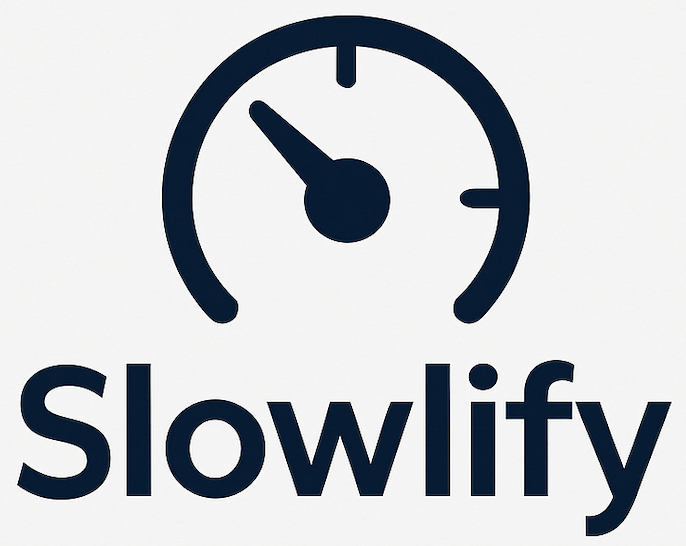

<p align="center">
  <picture>
    <source media="(prefers-color-scheme: dark)" srcset="images/logo-dark.png" width="343" height="273">
    <source media="(prefers-color-scheme: light)" srcset="images/logo.png" width="343" height="273">
    
  </picture>
</p>

<p align="center">
  <strong>Simulate slow, overloaded, or resource-constrained machines to reproduce CI failures and hunt flaky tests.</strong>
</p>

Your tests pass locally on your fast machine but fail mysteriously on CI. Slowlify uses Linux cgroups v2 to throttle CPU, limit memory, and inject system call delays—exposing race conditions, timing bugs, and resource-related failures that only appear on constrained hardware.

## Quick Start

```bash
# Run tests as if on a slow CI machine
sudo ./slowlify --profile ci -- make test

# Hunt for race conditions
sudo ./slowlify --profile race -- ./my_concurrent_test

# Find flaky tests (runs 50 times)
sudo ./slowlify --profile flaky -- pytest tests/test_suspicious.py

# Absolute worst case - potato PC simulation
sudo ./slowlify --profile potato -- ./my_test
```

## How It Works

Slowlify layers multiple Linux mechanisms to create a convincingly slow environment. When you run a command, it creates an isolated cgroup with hard CPU and memory limits, pins the process to specific CPU cores, and lowers priority via nice and ionice. For extreme cases, SCHED_IDLE makes the process run only when nothing else wants the CPU.

The clever part is syscall delay injection via strace. By adding microsecond delays to operations like `futex` (thread synchronization), `open` (file access), or `connect` (network), you can expose race conditions that depend on timing. A test that passes when `open()` returns instantly might fail when it takes 100ms—exactly what happens on an overloaded CI machine.

Background CPU burners create contention on the same cores your process uses, simulating a noisy neighbor environment. Combined with memory pressure, you get a realistic simulation of the worst shared CI runner.

| Mechanism | Tool | What It Does |
|-----------|------|--------------|
| CPU Quota | cgroups v2 | Hard limit on CPU time (e.g., 10% means 10ms per 100ms) |
| CPU Affinity | `taskset` | Pin process to specific cores, preventing load balancing |
| Process Priority | `nice` | Lower scheduling priority (19 = lowest) |
| I/O Priority | `ionice` | Deprioritize disk access (class 3 = idle) |
| Scheduler Class | `chrt` | SCHED_IDLE runs only when system is idle |
| Memory Limit | cgroups v2 | Hard cap triggers OOM, soft cap triggers reclaim pressure |
| Syscall Delays | `strace` | Inject microsecond delays into specific system calls |
| CPU Contention | bash loop | Background load competing for the same cores |

## Profiles

Built-in presets for common scenarios:

| Profile | CPU | RAM | Use Case |
|---------|-----|-----|----------|
| `slow` | 25% | 256M | Budget CI runner |
| `crawl` | 5% | 128M | Ancient hardware, SCHED_IDLE |
| `ci` | 15% | 256M | Overloaded shared CI with contention |
| `race` | 30% | 512M | Expose race conditions (futex delays) |
| `race-io` | 30% | 512M | File I/O race conditions |
| `race-net` | 30% | 512M | Network race conditions |
| `mem-pressure` | 50% | 64M | Near-OOM memory pressure |
| `potato` | 2% | 64M | Worst case scenario |
| `flaky` | 20% | 256M | Hunt flaky tests (50 repeats) |

## Usage

```
sudo ./slowlify [OPTIONS] -- <command> [args...]
```

### CPU Throttling

```bash
sudo ./slowlify -c 10 -- ./my_test                # Limit to 10% CPU
sudo ./slowlify --cores 0 -- ./my_test            # Pin to CPU core 0
sudo ./slowlify --idle -- ./my_test               # SCHED_IDLE (runs only when idle)
```

### Memory Limits

```bash
sudo ./slowlify -m 128M -- ./my_test              # Hard limit (OOM killer at 128M)
sudo ./slowlify -m 128M --memory-high 96M -- ./my_test  # Soft + hard limit
```

### Race Condition Detection

```bash
sudo ./slowlify --strace "futex:50000" -- ./concurrent_test   # Thread sync delays
sudo ./slowlify --strace "open:100000" -- ./file_test         # File open delays
sudo ./slowlify --strace "connect:200000" -- ./network_test   # Network delays
```

### CPU Contention & Repetition

```bash
sudo ./slowlify --stress -- ./my_test             # 80% background load
sudo ./slowlify --repeat 50 -- ./sometimes_fails  # Run 50 times
sudo ./slowlify --profile ci -c 5 -- make test    # Profile + override
```

## Options Reference

| Option | Description | Default |
|--------|-------------|---------|
| `-p, --profile NAME` | Use a preset profile | - |
| `-c, --cpu PERCENT` | CPU quota (1-100) | 20 |
| `--cores CPUS` | CPU affinity (e.g., "0" or "0,1") | 0 |
| `--idle` | Use SCHED_IDLE scheduler | false |
| `-m, --memory LIMIT` | Hard memory limit | 256M |
| `--memory-high LIMIT` | Soft memory limit (triggers reclaim) | - |
| `--nice LEVEL` | Nice level (0-19) | 19 |
| `--ionice CLASS` | I/O class (1=RT, 2=BE, 3=idle) | 3 |
| `--strace SPEC` | Inject syscall delays | - |
| `--stress` | Enable background CPU load | false |
| `--stress-load PCT` | Background load percentage | 80 |
| `--repeat N` | Run command N times | 1 |
| `-e, --env VAR[=val]` | Pass environment variable | - |
| `-v, --verbose` | Show configuration details | false |
| `--check-deps` | Verify dependencies | - |
| `--cleanup` | Remove stale cgroups | - |

## Requirements

Slowlify requires **Linux** with cgroups v2 (unified hierarchy) and **root access** for cgroup manipulation. You'll need `taskset`, `nice`, `ionice`, and `chrt` from util-linux. For syscall delay injection, `strace` is optional but recommended.

Check your system with `sudo ./slowlify --check-deps`.

## Real-World Examples

```bash
# Debug a flaky pytest test
sudo ./slowlify --profile flaky -- pytest tests/test_database.py::test_concurrent_writes -v

# Reproduce CI timeout
sudo ./slowlify --profile potato -- timeout 60 make test

# Test memory-constrained embedded target
sudo ./slowlify -c 10 -m 32M -- ./embedded_simulator

# Find race condition in Go program
sudo ./slowlify --profile race -- go test -race ./...

# Stress test under load
sudo ./slowlify --stress -c 50 --repeat 10 -- ./performance_test
```

## License

MIT License — See [LICENSE](LICENSE) for details.

## Contributing

Contributions welcome! See [CONTRIBUTING.md](CONTRIBUTING.md) for guidelines.
